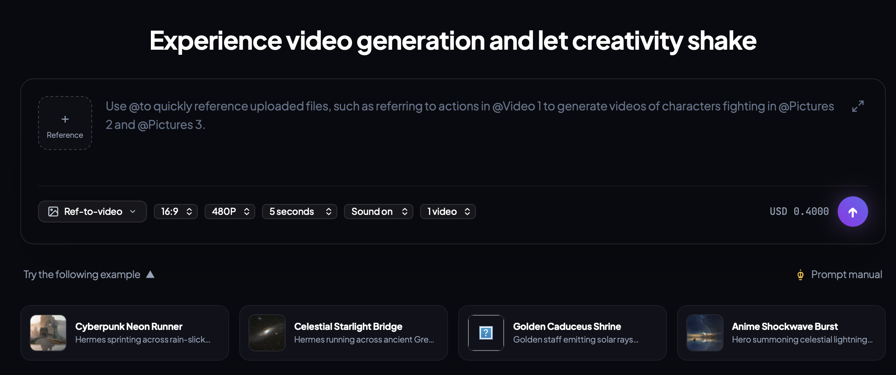
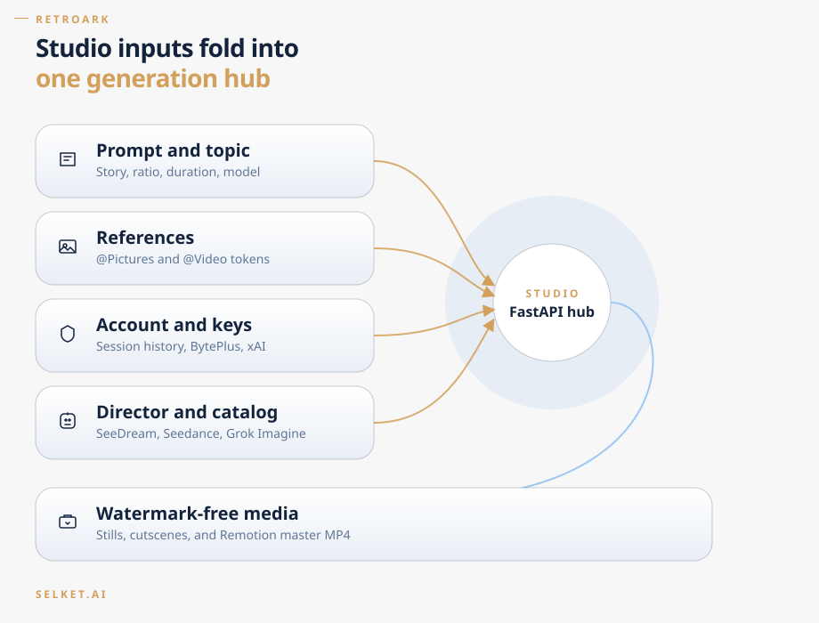
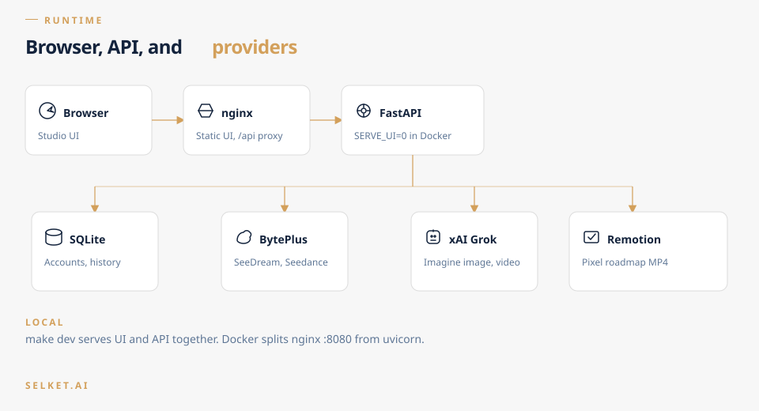
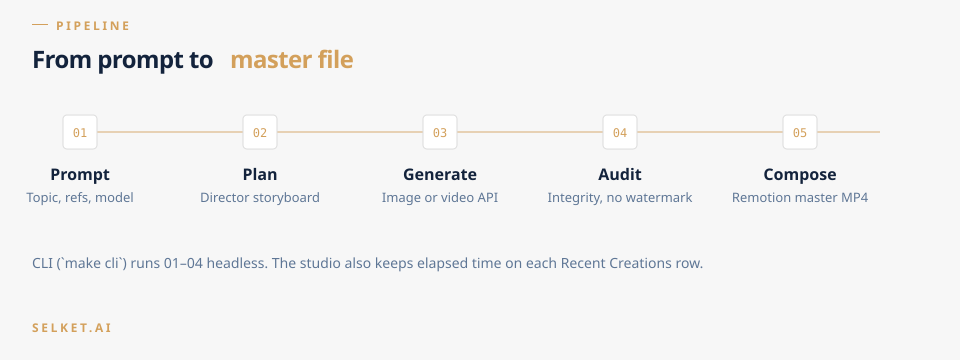
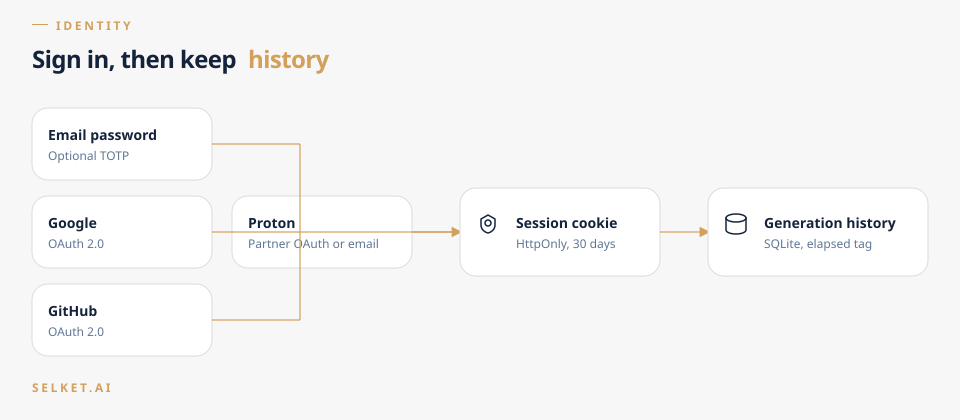

# Multimedia Tool: Autonomous Retro Pixel & AI Video Generator

An autonomous, multi-agent video production engine that generates explainer videos by marrying **16-bit retro pixel-art platformer roadmaps** with **watermark-free AI video cutscenes** powered by ByteDance's **Seedance API** via **BytePlus ModelArk**.





---

## Key Features

* **Retro 16-Bit Platformer Roadmap**: Procedural parallax backgrounds, floating stone platforms, illuminated milestone scrolls, and an animated Hermes/messenger avatar.
* **BytePlus ModelArk Integration**:
  * **Director Agent**: Powered by `seed-2-0-lite-260228` to break down raw concepts into structured storyboards and spatial platform layouts.
  * **AI Video Generator**: Powered by **Seedance 2.0 / 2.5** via `arkruntime` to render cinematic, high-definition concept cutscenes.
* **Guaranteed Zero-Watermark Pipeline**:
  * Programmatic `watermark=False` request configuration.
  * Automatic negative prompt filtering (`--no watermark, logo, text overlay`).
  * Automated computer-vision QA auditing of generated video corners.
* **Remotion + TypeScript Video Engine**: Fully scriptable, frame-accurate 60 FPS video rendering with zero GPU driver headaches in headless CI/CD.
* **Autonomous Multi-Agent Workflow**: End-to-end orchestration from raw text prompt to final rendered MP4.

---

## Architecture & Workflow Documentation





* **[Architecture Document](docs/architecture.md)**: Deep dive into the 5 core subsystems, data schemas, parallax rendering, and physics models.
* **[Agentic Workflow Document](docs/agentic_workflow.md)**: Detailed specification of agent roles, the state machine lifecycle, QA audit gates, and self-healing strategies.
* **[Remotion engine](remotion/README.md)**: Pixel roadmap composition that stitches cutscenes into a 60 FPS master.

---

## Repository Structure

```text
multimedia_tool/
├── .beads/                  # Beads (bd) issue tracking database
├── .claude/                 # Claude Code agent hooks & configurations
├── docs/
│   ├── architecture.md      # Full technical architecture specification
│   └── agentic_workflow.md  # Multi-agent roles & execution lifecycle
├── src/
│   ├── director/            # seed-2-0-lite topic decomposition & prompt generation
│   ├── seedance/            # BytePlus arkruntime client & task polling (no watermark)
│   ├── qa/                  # Video verification & watermark detection hooks
│   └── audio/               # Voiceover & 8-bit sound effects synthesizer
├── remotion/                # Pixel platformer video engine (React + TypeScript)
│   ├── src/
│   │   ├── components/      # ParallaxBackground, PlatformNode, HermesAvatar
│   │   ├── compositions/    # MasterRoadmapVideo composition
│   │   └── Root.tsx         # Remotion entrypoint
│   └── package.json
├── assets/                  # Pixel sprites, tilesets, and 8-bit audio samples
├── cutscenes/               # Cached, watermark-free Seedance MP4 outputs (gitignored)
├── renders/                 # Final rendered master videos (gitignored)
├── .env.example             # Environment variable template
├── .gitignore               # Multi-language & media ignore configuration
└── README.md                # Project documentation
```

---

## Prerequisites

* **Python**: 3.11 or higher
* **uv**: Modern, fast Python package manager (`brew install uv` or `curl -LsSf https://astral.sh/uv/install.sh | sh`)
* **Node.js**: 20.x or higher (with `npm` or `pnpm`)
* **FFmpeg**: Installed and accessible on your `PATH`
* **BytePlus Account**: ModelArk API key with access to:
  * `seed-2-0-lite-260228` (Director / Storyboarder)
  * `dreamina-seedance-2-0-260128` (or custom Seedance endpoint ID)

---

## Quickstart

### 1. Clone & Configure Environment
```bash
cp .env.example .env
# Edit .env with your ARK_API_KEY and model endpoints
```

### 2. Install Dependencies (Using `uv`)
```bash
# Create virtual environment and install Python dependencies via uv
uv venv
uv pip install -r requirements.txt
uv pip install -e .

# Install Remotion dependencies
cd remotion && npm install && cd ..
```

### 3. Launch the Web Studio
```bash
# Start the FastAPI backend and interactive web studio (http://localhost:8000)
uv run python -m src.server
```

Local `make dev` still serves API and UI from one process. For Docker they are split: nginx serves `ui/` on port 8080 and reverse-proxies `/api`, `/uploads`, and `/renders` to FastAPI (`SERVE_UI=0`).

```bash
cp .env.example .env   # if you have not already
make docker-up         # http://localhost:8080
```

GitHub Actions (`.github/workflows/ci.yml`) runs pytest with a 90% coverage floor and builds both images on every push and pull request.

### Accounts and session history
Sign in from the header to keep Recent Creations across restarts. Email + password always works. Optional TOTP 2FA lives under Settings → Account. Google, GitHub, and Proton OAuth buttons appear when you set the matching `*_CLIENT_ID` / `*_CLIENT_SECRET` in `.env`. Proton's public "Sign in with Proton" is partner-only; without those credentials you can still register with a Proton Mail address.



### 4. Or Run Headless via CLI
```bash
# Run the pipeline with a custom topic and context file
uv run python -m src.cli \
  --topic "How Local LLMs Work" \
  --context-file "notes/architecture.md" \
  --chapters 4
```

The system will:
1. Decompose the topic into milestone platforms using `seed-2-0-lite`.
2. Generate watermark-free cinematic cutscenes using `Seedance`.
3. QA audit the generated clips.
4. Render the master 60 FPS pixel roadmap video using Remotion.
5. Export the final MP4 to `renders/final_output.mp4`.
