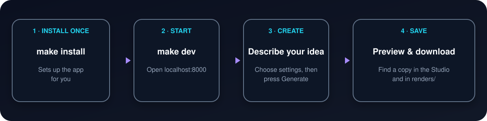

# Multimedia Tool

Create AI images, videos, music, and interactive story worlds from one browser-based Studio.

You do not need to know Python or TypeScript to use it. The `Makefile` handles setup and startup for you.


## Start here

You need these free tools installed first:

- [Git](https://git-scm.com/downloads)
- [uv](https://docs.astral.sh/uv/getting-started/installation/)
- [Node.js 20 or newer](https://nodejs.org/en/download)
- [FFmpeg](https://ffmpeg.org/download.html)

Then open a terminal in this project folder and run:

```bash
make install
make dev
```

Open **[http://localhost:8000](http://localhost:8000)** in your browser. Keep the terminal window open while you use the Studio.



> You only need `make install` the first time. On later visits, run `make dev`.

## Add an API key

The Studio needs a key from the service that creates your media. You can add it inside the app—there is no need to edit a configuration file.

1. Open **Settings** in the left sidebar.
2. Paste the key for the service you want to use:
   - **BytePlus ModelArk** for Seedance and Seedream
   - **xAI** for Grok image and video generation
   - **Mureka** for music and audio
3. Save the settings.

API keys are private credentials. Do not paste them into the README, commit them to Git, or share them in screenshots.

## Create something

1. Choose a workspace from the left sidebar, such as image/video, audio, or RPG world generation.
2. Describe what you want in the large prompt box.
3. Optionally add reference files and change the output settings.
4. Select **Generate** (the arrow button).
5. Wait for the preview, then select **Download**.

The Studio shows an estimated API cost before generation when the provider supplies pricing information. Generated files are also written to the `renders/` folder.

Creating an account is optional. Sign in only if you want the Studio to keep your generation history and show it in **Library** after a restart.

## Everyday commands

Run these commands from the project folder:

```text
make dev          Start the Studio at http://localhost:8000
make install      Install or refresh the required packages
make docker-up    Start the Docker version at http://localhost:8080
make docker-down  Stop the Docker version
make help         Show every available command
```

Press `Control+C` in the terminal to stop `make dev`.

## If something goes wrong

**The browser says it cannot connect**

Make sure `make dev` is still running and shows no error in the terminal, then reload [http://localhost:8000](http://localhost:8000).

**The terminal says a command is missing**

Install the missing prerequisite from the links above, close and reopen the terminal, then run `make install` again.

**Generate says an API key is required**

Open **Settings**, add the key for the selected provider, and save it. A BytePlus key cannot be used with xAI, and an xAI key cannot be used with BytePlus.

**Generation takes a long time**

Video and audio providers process jobs remotely, so they can take several minutes. Keep the Studio and terminal open while the job is running.

**I changed dependencies or pulled a project update**

Run `make install` again, then restart the Studio with `make dev`.

## Docker option

If Docker Desktop is already installed, you can use the containerized version instead:

```bash
make docker-up
```

Open **[http://localhost:8080](http://localhost:8080)**. Stop it later with `make docker-down`.

## For developers

The beginner workflow ends above. These documents explain the internals:

- [System architecture](docs/architecture.md)
- [Agent workflow](docs/agentic_workflow.md)
- [Remotion video engine](remotion/README.md)
- [Frontend design notes](docs/frontend_design.md)

Useful development commands:

```text
make test        Run the test suite
make coverage    Run tests and build a coverage report
make remotion    Open the Remotion preview
make cli         Run the demo Seedance pipeline
make cli-grok    Run the demo Grok pipeline
make clean       Remove generated caches and temporary render files
```

The application is built with FastAPI, Python, Remotion, React, and TypeScript. For local development, `make dev` serves the API and browser UI together. In Docker, nginx serves the UI on port 8080 and forwards API requests to FastAPI.
