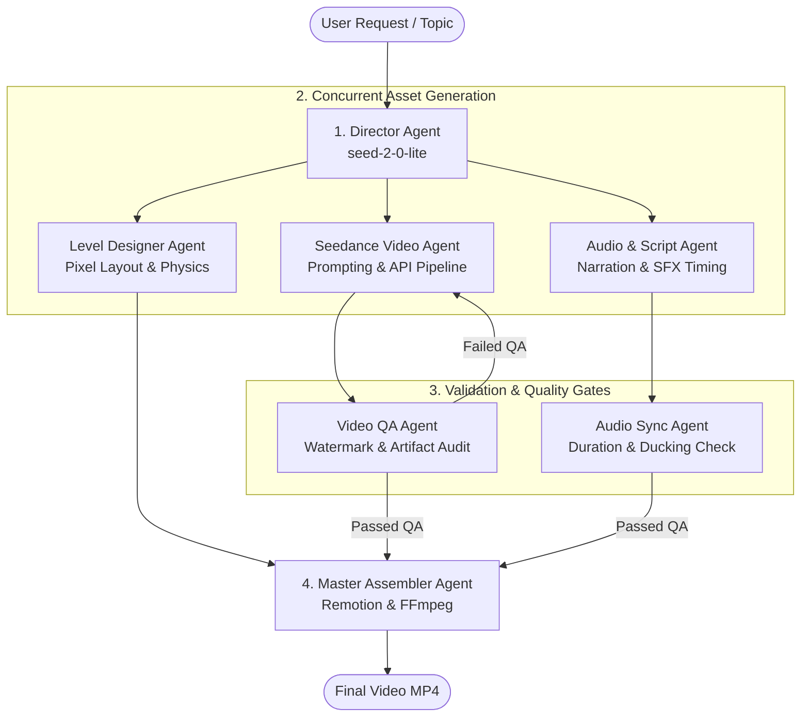
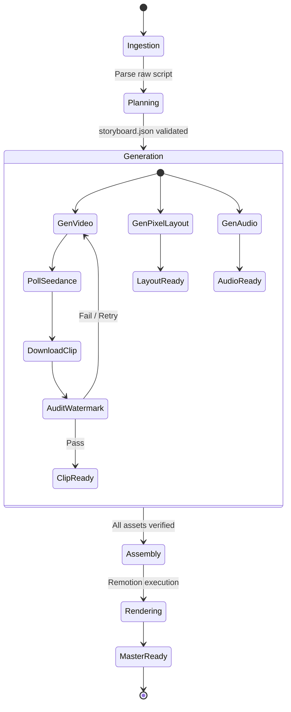

# Autonomous Agentic Workflow Specification

## 1. Overview

This document specifies the multi-agent orchestration architecture driving the multimedia generation tool. The pipeline is structured as an autonomous collaborative agent system that transforms high-level topics or raw transcripts into fully assembled multimedia productions with zero manual video editing.

---

## 2. Agent Roles & Responsibilities

### 2.1. Director Agent (`DirectorAgent`)
* **Underlying Model**: BytePlus ModelArk `seed-2-0-lite-260228`
* **Responsibilities**:
  * Analyze input topic, identify narrative arc, and partition content into chapters.
  * Define pacing and determine transition moments between pixel exploration and AI cutscenes.
  * Generate the canonical `storyboard.json` data manifest.

### 2.2. Level Designer Agent (`LevelDesignerAgent`)
* **Responsibilities**:
  * Calculate $(x, y)$ platform placement on the 1920x1080 canvas.
  * Compute parabolic jump curves, velocity vectors, and gravity values so character transitions are aesthetically pleasing and physically believable.
  * Configure signpost styling, scroll dimensions, and activation triggers.

### 2.3. Seedance Video Agent (`SeedanceVideoAgent`)
* **Responsibilities**:
  * Translate high-level chapter concepts into optimized diffusion video prompts.
  * Enforce strict negative prompting constraints (`--no watermark, logo, text, subtitles, UI`).
  * Dispatch asynchronous requests via `arkruntime` with parameter `watermark=False`.
  * Track and poll task IDs with non-blocking exponential backoff.

### 2.4. Video QA & Watermark Audit Agent (`VideoQAAgent`)
* **Responsibilities**:
  * Inspect newly downloaded `.mp4` cutscenes using automated computer-vision checks.
  * **Watermark Detection**: Sample corner quadrants (bottom-right and top-right) across keyframes to detect static logo stamps, high-contrast corner glyphs, or text badges.
  * **Artifact Detection**: Detect frame freezes, black screens, or visual tearing.
  * **Feedback Loop**: If a watermark or artifact is detected, reject the clip, adjust the prompt seed/negative constraints, and trigger an automated re-generation.

### 2.5. Audio & Script Agent (`AudioAgent`)
* **Responsibilities**:
  * Synthesize voiceover audio for each chapter segment.
  * Extract exact audio duration in milliseconds.
  * Synchronize character platform arrival time with voiceover onset.
  * Place 8-bit sound effects (jump arc, landing, sign illumination).

### 2.6. Master Assembler Agent (`AssemblerAgent`)
* **Responsibilities**:
  * Collate `storyboard.json`, verified `cutscenes/*.mp4`, and synthesized audio tracks.
  * Execute Remotion rendering pipeline (`npx remotion render`).
  * Perform final FFmpeg muxing, color space normalization, and master packaging.

---

## 3. State Machine & Execution Lifecycle

### State Definitions:
1. **`STATE_INGESTION`**: Reads user input or source article.
2. **`STATE_PLANNING`**: Director Agent invokes `seed-2-0-lite-260228` and writes `storyboard.json`.
3. **`STATE_ASSET_GENERATION`**:
   * Seedance tasks created concurrently with `watermark=False`.
   * Voiceover audio files generated.
   * Remotion scene component graph hydrated.
4. **`STATE_QA_AUDIT`**:
   * Frame verification runs on video clips.
   * Audio length is matched against animation timestamps to ensure no audio truncation.
5. **`STATE_ASSEMBLY_RENDER`**:
   * Remotion executes headless rendering using Chromium.
   * Frame-by-frame compositing stitches pixel roadmap, transitions, cutscenes, and sound.
6. **`STATE_COMPLETED`**: Final MP4 saved to `renders/final_output.mp4`.

---

## 4. Error Handling & Self-Healing Strategies

| Failure Scenario | Detection Mechanism | Recovery Action |
| :--- | :--- | :--- |
| **Seedance Task Timeout / Rate Limit** | HTTP 429 or status `timeout` after 180s | Exponential backoff $(2^n \times \text{delay})$, fallback to secondary endpoint |
| **Watermark / Artifact Hallucination** | QA Agent flags high pixel density in bottom-right corner | Re-generate with modified seed and explicit negative prompt weighting |
| **Audio-Video Desynchronization** | Audio track duration exceeds platform dwell time | Dynamically scale platform idle duration to match voiceover length |
| **Remotion Frame Crash** | Chromium process exit code $\neq 0$ | Reduce concurrency from 4 threads to 2 threads and re-attempt |

---

## 5. Human-In-The-Loop (HITL) Controls

While fully autonomous, the system exposes command-line checkpoints for optional human curation:
* `--preview-plan`: Generates and prints the `storyboard.json` milestones and video prompts without initiating generation.
* `--regenerate-chapter <ID>`: Re-rolls a single Seedance cutscene or voiceover segment without re-rendering unaffected chapters.
* `--interactive`: Pauses before final rendering to allow the user to review the generated cutscene clips.
