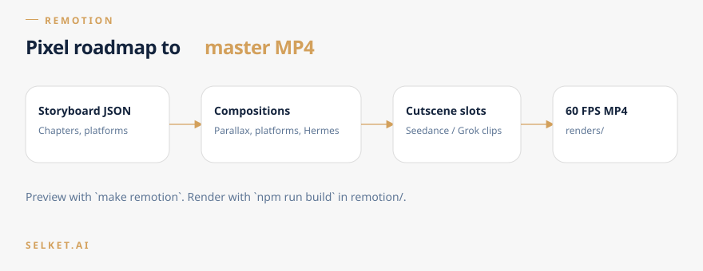

# Remotion pixel engine

Frame-accurate 60 FPS renderer for the retro platformer roadmap. It reads the Director storyboard, places Hermes on milestone platforms, and slots watermark-free cutscenes between chapters.



## Preview

```bash
make remotion
# or: cd remotion && npm start
```

## Render

```bash
cd remotion
npm run build
```

That runs `remotion render src/index.ts MasterRoadmapVideo out/final_output.mp4`.

## Layout

- `src/Root.tsx` — composition registration
- `src/compositions/MasterRoadmapVideo.tsx` — master timeline
- `src/components/` — `ParallaxBackground`, `PlatformNode`, `HermesAvatar`
